# AndroGoat Android Security Assessment

> **Application:** AndroGoat – Insecure App
> 
> **Package:** `owasp.sat.agoat`
> 
> **Platform:** Android
> 
> **Assessment type:** Authorized mobile security training assessment
> 
> **Environment:** Local Android emulator (Nox)
> 
> **Methodology:** OWASP Mobile Security Testing Guide (MSTG)
> 
> **Assessor:** Mohamed Hossam Elshamsi
> 
> **Assessment date:** 2026

> **Authorization disclaimer:** This assessment was performed exclusively against AndroGoat, an intentionally vulnerable training application, in an authorized lab environment. No production apps, real user accounts, or third‑party services were tested. The content is shared for educational and defensive purposes only.

## Executive summary

This assessment identified **13 vulnerabilities** across multiple OWASP Mobile Top 10 categories, including several forms of Insecure Data Storage, Cleartext Network Communication, Hardcoded Secrets, Data Tampering, Access Control issues (Unprotected Activities / Services / Deep Links / Content Providers), and weak defense‑in‑depth mechanisms (bypassable Root and Emulator detection).

Severity estimates describe the demonstrated lab behavior and should be recalculated for a production deployment using the exact asset, exposure, and business impact.

### Severity distribution

| Severity | Count |
|----------|-------|
| 🔴 High | 5 |
| 🟠 Medium | 5 |
| 🟡 Low | 3 |

## Scope and methodology

### In scope

- AndroGoat challenges covering:
  - Insecure data storage (SharedPreferences, SQLite, temporary files, external storage)
  - Data tampering via Shared Preferences
  - Hardcoded secrets (promocode)
  - Cleartext HTTP communication
  - Unprotected components (exported activity, service, deep link, content provider)
  - Root and emulator detection weaknesses
- Local emulator / test device only

### Methodology
 
1. Installed AndroGoat on an authorized emulator/test device.
2. Performed static review of the APK (manifest, resources, decompiled code).
3. Exercised each challenge and captured behavior with screenshots.
4. Validated insecure storage, component exposure, and client‑side logic using ADB and standard tooling.
5. Documented root cause, practical impact, remediation, and retest criteria.
## Findings summary
 
| # | Vulnerability | Severity | CVSS v3.1 estimate | OWASP Mobile Top 10 |
|---|--------------|----------|--------------------|---------------------|
| 1 | Insecure Data Storage — SharedPreferences | High | 7.5 | M2: Insecure Data Storage |
| 2 | Insecure Data Storage — SQLite Database | High | 7.5 | M2: Insecure Data Storage |
| 3 | Insecure Data Storage — Temporary Files | High | 7.5 | M2: Insecure Data Storage |
| 4 | Insecure Data Storage — External Storage / SD Card | High | 7.5 | M2: Insecure Data Storage |
| 5 | Data Tampering — Shared Preferences | Medium | 5.5 | M8: Code Tampering |
| 6 | Hardcoded Secrets — Promocode Bypass | Medium | 5.3 | M9: Reverse Engineering |
| 7 | Unprotected Components — Direct Activity Launch | Medium | 5.3 | M1: Improper Platform Usage |
| 8 | Unprotected Components — Exported Service | Medium | 5.3 | M1: Improper Platform Usage |
| 9 | Unprotected Components — Deep Link Bypass | Medium | 5.3 | M1: Improper Platform Usage |
| 10 | Unprotected Components — Exported Content Provider | Low | 3.3 | M1: Improper Platform Usage |
| 11 | Inadequate Root Detection | Low | 3.3 | M8: Code Tampering |
| 12 | Inadequate Emulator Detection | Low | 3.3 | M9: Reverse Engineering |
 
---
 
## 1. Insecure Data Storage — Shared Preferences (cleartext credentials)
 
- **Severity:** High (CVSS 3.1: 7.5 — `CVSS:3.1/AV:L/AC:L/PR:N/UI:N/S:U/C:H/I:H/A:N`)
- **CWE:** [CWE-312: Cleartext Storage of Sensitive Information](https://cwe.mitre.org/data/definitions/312.html)
- **Description:** The application stores highly sensitive user data, including usernames and passwords, in plain text within its `SharedPreferences` file (`users.xml`).
- **Impact:** Any malicious application that gains root access, or an attacker with physical access to the device (or device backups), can easily read these sensitive credentials, leading to full account compromise.
- **Proof of Concept:**
  **Step 1:** The user enters credentials (`test`/`test`) in the "Shared Preferences — Part 1" activity and taps SAVE:
  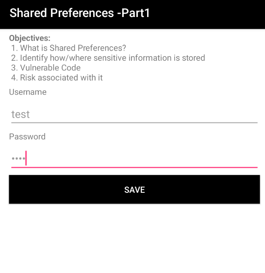
  **Step 2:** Using ADB shell, navigating to the application's internal data directory at `/data/data/owasp.sat.agoat/` and listing the contents:
  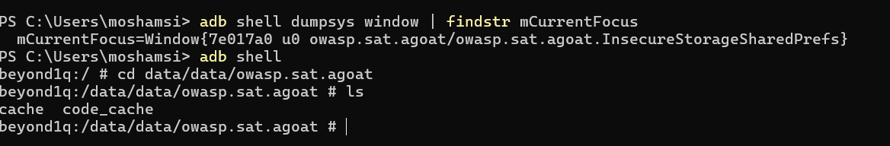
  **Step 3:** Reading `shared_prefs/users.xml` via `cat` exposes the credentials in plain text (`<string name="password">test</string>`):
  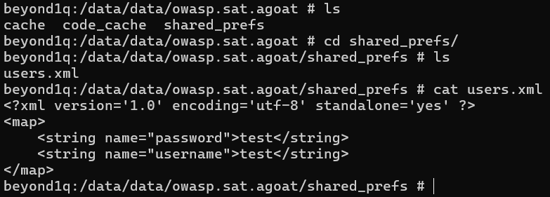
- **Mitigation:**
  - Utilize `EncryptedSharedPreferences` from the Jetpack Security library.
  - Use the Android Keystore system to securely generate and store cryptographic keys.
  - Never store raw passwords; use salted hashes if local validation is required.
- **References:**
  - [OWASP Mobile Top 10 — M2: Insecure Data Storage](https://owasp.org/www-project-mobile-top-10/2016-risks/m2-insecure-data-storage)
  - [CWE-312: Cleartext Storage of Sensitive Information](https://cwe.mitre.org/data/definitions/312.html)
---
 
## 2. Insecure Data Storage — SQLite Database (cleartext credentials)
 
- **Severity:** High (CVSS 3.1: 7.5 — `CVSS:3.1/AV:L/AC:L/PR:N/UI:N/S:U/C:H/I:H/A:N`)
- **CWE:** [CWE-312: Cleartext Storage of Sensitive Information](https://cwe.mitre.org/data/definitions/312.html)
- **Description:** The application stores user credentials in an unencrypted SQLite database (`aGoat`) within the app's internal storage directory.
- **Impact:** An attacker with root access or physical access can extract the database file and read all stored user records in plain text.
- **Proof of Concept:**
  **Step 1:** The user enters credentials in the "SQLite" challenge activity and taps SAVE:
  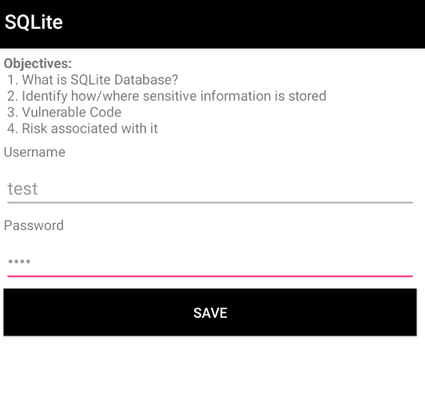
  **Step 2:** Using the `sqlite3` command-line tool via ADB to open the database and query the `users` table reveals plain text credentials (`test|test`):
  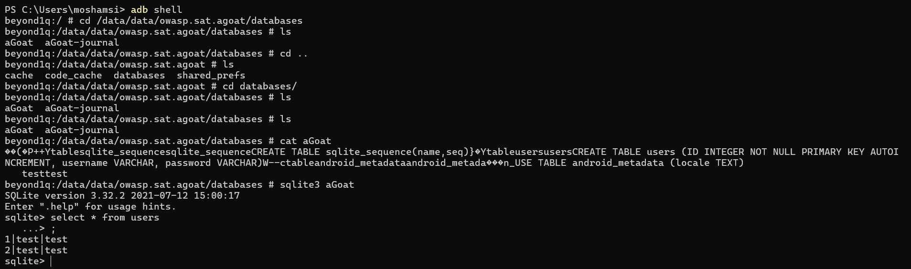
- **Mitigation:**
  - Use SQLCipher or a similar encrypted database solution.
  - Never store raw passwords; use salted hashes with a strong algorithm (e.g., bcrypt, Argon2).
- **References:**
  - [OWASP Mobile Top 10 — M2: Insecure Data Storage](https://owasp.org/www-project-mobile-top-10/2016-risks/m2-insecure-data-storage)
  - [CWE-312: Cleartext Storage of Sensitive Information](https://cwe.mitre.org/data/definitions/312.html)
---
 
## 3. Insecure Data Storage — Temporary Files (cleartext credentials)
 
- **Severity:** High (CVSS 3.1: 7.5 — `CVSS:3.1/AV:L/AC:L/PR:N/UI:N/S:U/C:H/I:H/A:N`)
- **CWE:** [CWE-312: Cleartext Storage of Sensitive Information](https://cwe.mitre.org/data/definitions/312.html)
- **Description:** The application writes sensitive user information to temporary files (e.g., `users...tmp`) in its internal storage directory without any form of encryption.
- **Impact:** Temporary files can be accessed by attackers on rooted devices or through local backups, exposing sensitive credentials.
- **Proof of Concept:**
  **Step 1:** The user enters credentials in the "Temp File" challenge activity:
  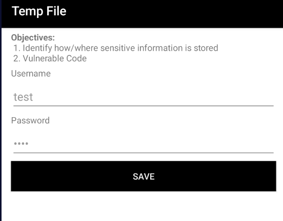
  **Step 2:** Accessing the app's internal directory via ADB reveals a `.tmp` file containing the username and password in plain text:
  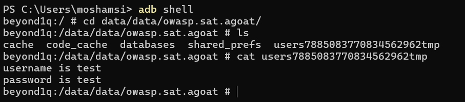
- **Mitigation:**
  - Avoid writing sensitive data to temporary files entirely.
  - If required, encrypt the data before writing and ensure the files are securely deleted (`File.deleteOnExit()`) immediately after use.
- **References:**
  - [OWASP Mobile Top 10 — M2: Insecure Data Storage](https://owasp.org/www-project-mobile-top-10/2016-risks/m2-insecure-data-storage)
  - [CWE-312: Cleartext Storage of Sensitive Information](https://cwe.mitre.org/data/definitions/312.html)
---
 
## 4. Insecure Data Storage — External Storage / SD Card (world‑readable credentials)
 
- **Severity:** High (CVSS 3.1: 7.5 — `CVSS:3.1/AV:L/AC:L/PR:N/UI:N/S:U/C:H/I:H/A:N`)
- **CWE:** [CWE-922: Insecure Storage of Sensitive Information](https://cwe.mitre.org/data/definitions/922.html)
- **Description:** The application writes sensitive user credentials to external storage (`/storage/emulated/0/`), which is world‑readable by any application with `READ_EXTERNAL_STORAGE` permission.
- **Impact:** Unlike internal app storage, external storage has no sandboxing. Any app on the device can read these files, making credential theft trivial without even requiring root access.
- **Proof of Concept:**
  **Step 1:** The application requests broad "Files and media" permissions ("Allow management of all files"):
  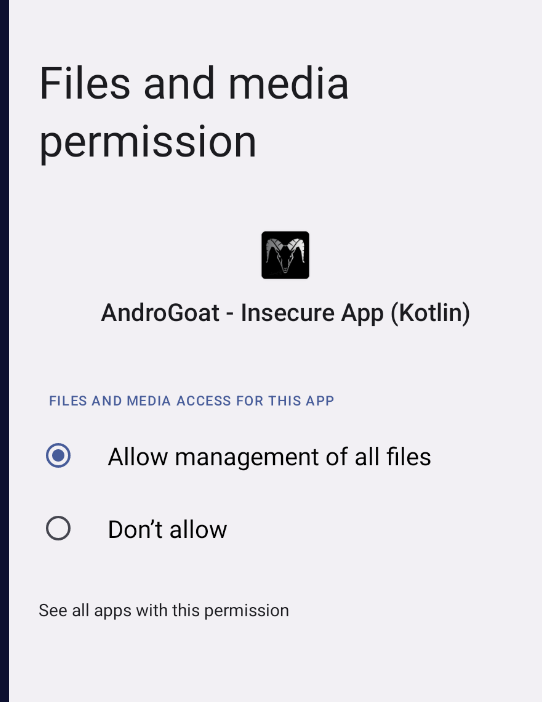
  **Step 2:** The user enters credentials in the "External Storage – SDCard" challenge and taps SAVE, which displays "Data saved":
  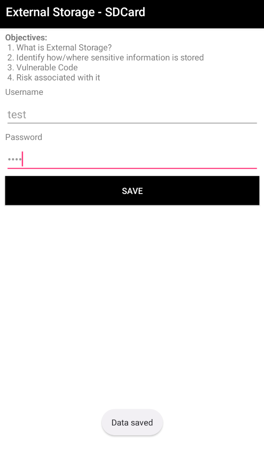
  **Step 3:** Navigating to `/storage/emulated/0/` via ADB reveals a file containing credentials in plain text (`Username – test Password – test`):
  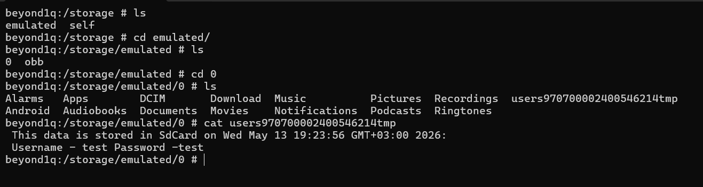
- **Mitigation:**
  - Never store sensitive data on external storage.
  - Use the app's private internal storage directory (`getFilesDir()`) with `MODE_PRIVATE`.
  - If external storage is absolutely required, encrypt data using the Android Keystore before writing.
- **References:**
  - [OWASP Mobile Top 10 — M2: Insecure Data Storage](https://owasp.org/www-project-mobile-top-10/2016-risks/m2-insecure-data-storage)
  - [CWE-922: Insecure Storage of Sensitive Information](https://cwe.mitre.org/data/definitions/922.html)
---
 
## 5. Data Tampering — Shared Preferences (game logic manipulation)
 
- **Severity:** Medium (CVSS 3.1: 5.5 — `CVSS:3.1/AV:L/AC:L/PR:N/UI:N/S:U/C:N/I:H/A:N`)
- **CWE:** [CWE-472: External Control of Assumed-Immutable Web Parameter](https://cwe.mitre.org/data/definitions/472.html)
- **Description:** The application relies on an insecurely stored integer in `SharedPreferences` (`score.xml`) to track the user's score in a minigame, which can be modified directly on disk.
- **Impact:** An attacker can manipulate local application state and business logic by altering data that the app trusts unconditionally. This can be extended to bypass in-app purchases, level restrictions, or other client-side checks.
- **Proof of Concept:**
  **Step 1:** The "Shared Preferences — Part 2" minigame requires 10,000 points to advance. Initial state shows Level 1, Score 0:
  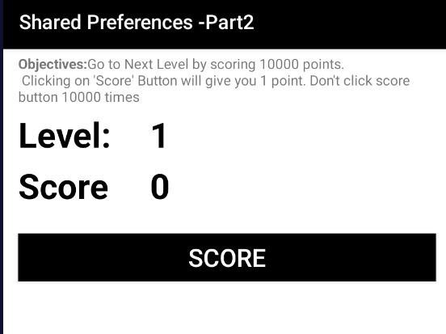
  **Step 2:** After a few taps, the score increments normally:
  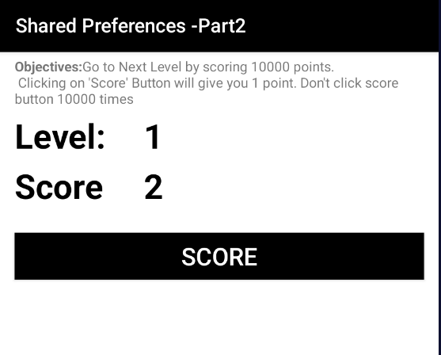
  **Step 3:** Pulling the `score.xml` file from `/data/data/owasp.sat.agoat/shared_prefs/` and opening it in a text editor reveals the score stored as a plain integer:
  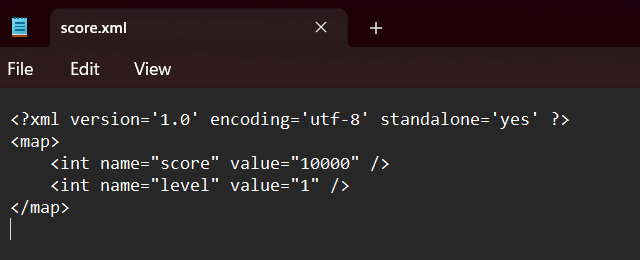
  **Step 4:** The original `score.xml` showing `<int name="score" value="..." />`:
  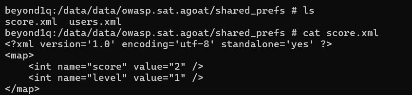
  **Step 5:** The attacker modifies `score.xml` to set `<int name="score" value="10000" />` and pushes it back to the device:
  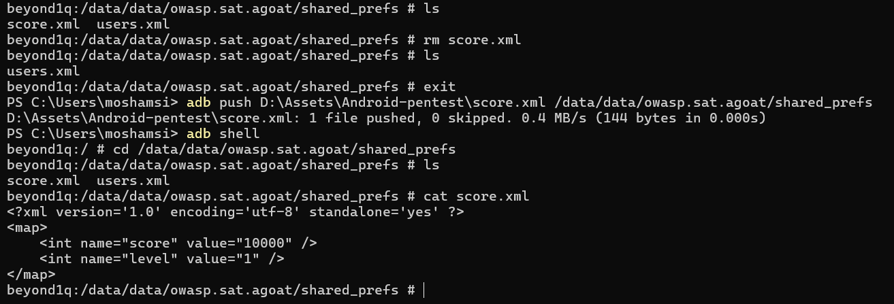
  **Step 6:** Upon reopening the activity, the app reads the tampered score and awards a win:
  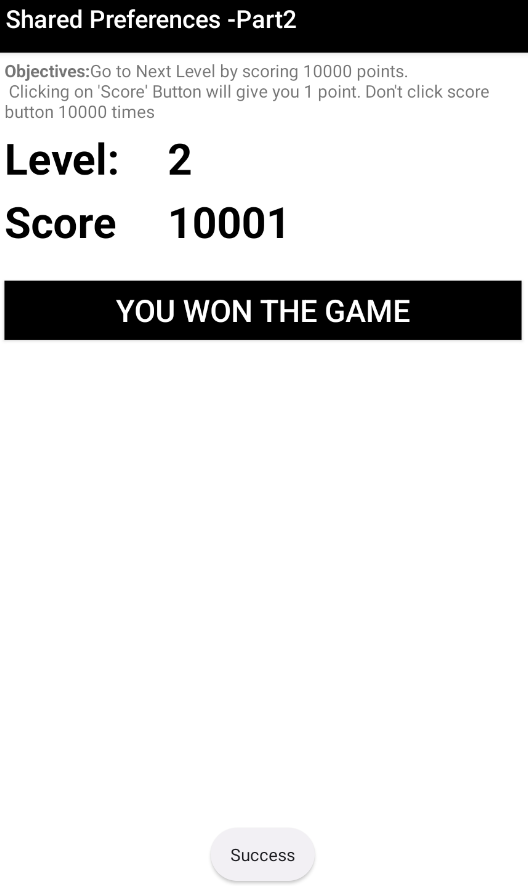
- **Mitigation:**
  - Store sensitive state variables on a remote server with server-side validation.
  - If local storage is necessary, use cryptographic signatures (HMAC) or `EncryptedSharedPreferences` to detect tampering.
- **References:**
  - [OWASP Mobile Top 10 — M8: Code Tampering](https://owasp.org/www-project-mobile-top-10/2016-risks/m8-code-tampering)
  - [CWE-472: External Control of Assumed-Immutable Web Parameter](https://cwe.mitre.org/data/definitions/472.html)
---
 
## 6. Hardcoded Secrets — Promocode Bypass
 
- **Severity:** Medium (CVSS 3.1: 5.3 — `CVSS:3.1/AV:L/AC:L/PR:N/UI:N/S:U/C:L/I:L/A:N`)
- **CWE:** [CWE-798: Use of Hard-coded Credentials](https://cwe.mitre.org/data/definitions/798.html)
- **Description:** The application contains a hardcoded promotional code (`NEW2019`) directly within the source code (`HardCodeActivity.java`).
- **Impact:** Attackers can decompile the APK using tools like jadx, easily discover the hardcoded secret, and exploit it to gain unauthorized benefits (e.g., obtaining products for free).
- **Proof of Concept:**
  **Step 1:** Decompiling the app with jadx and inspecting `HardCodeActivity` reveals `promoCode.element = "NEW2019";`:
  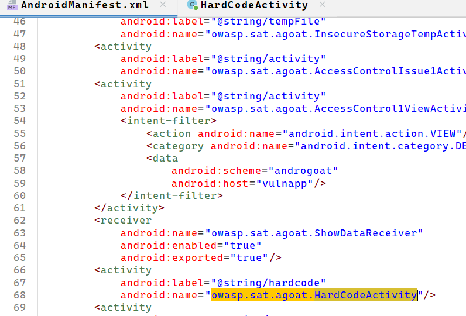
  **Step 2:** Entering the discovered code in the "Hardcode Issue" activity UI:
  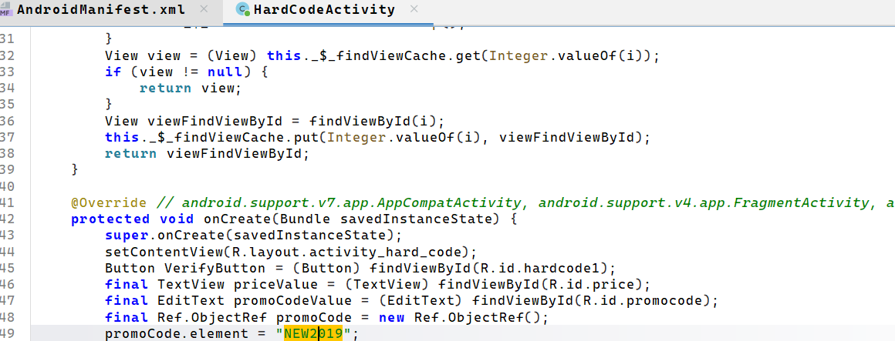
  **Step 3:** Successfully bypasses the cost, changing the price to 0 with the message "Congratulations! You got this product for free":
  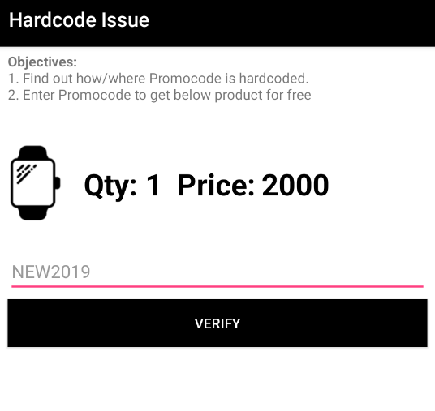
  **Step 4:** Final result showing `Qty: 1 Price: 0`:
  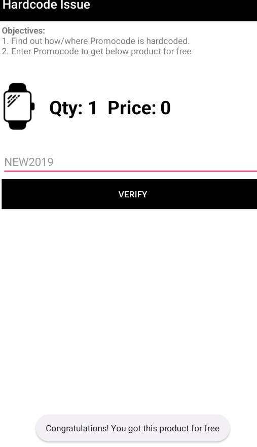
- **Mitigation:**
  - Do not hardcode secrets, tokens, or business‑logic bypass values in the APK.
  - Fetch promotional codes from a secure backend and validate server‑side.
  - Use obfuscation (ProGuard/R8) only as defense‑in‑depth.
- **References:**
  - [OWASP Mobile Top 10 — M9: Reverse Engineering](https://owasp.org/www-project-mobile-top-10/2016-risks/m9-reverse-engineering)
  - [CWE-798: Use of Hard-coded Credentials](https://cwe.mitre.org/data/definitions/798.html)
---
 
## 7. Unprotected Android Components — Direct Activity Launch (Access Control Bypass)
 
- **Severity:** Medium (CVSS 3.1: 5.3 — `CVSS:3.1/AV:L/AC:L/PR:N/UI:N/S:U/C:L/I:L/A:N`)
- **CWE:** [CWE-926: Improper Export of Android Application Components](https://cwe.mitre.org/data/definitions/926.html)
- **Description:** The `AccessControlIssue1Activity` is protected by a PIN verification screen. However, the underlying view activity (`AccessControl1ViewActivity`) can be launched directly via ADB or by a malicious app, completely bypassing the PIN check.
- **Impact:** An attacker or malicious app can invoke protected activities directly, bypassing authentication to access restricted functionalities such as viewing invoices.
- **Proof of Concept:**
  **Step 1:** The challenge presents a PIN verification screen:
  
  **Step 2:** Identifying the current activity via ADB (`adb shell dumpsys window | findstr mCurrentFocus` shows `AccessControlIssue1Activity`):
  
  **Step 3:** Static analysis of `AndroidManifest.xml` reveals the `AccessControlIssue1Activity` declaration and its corresponding view activity:
  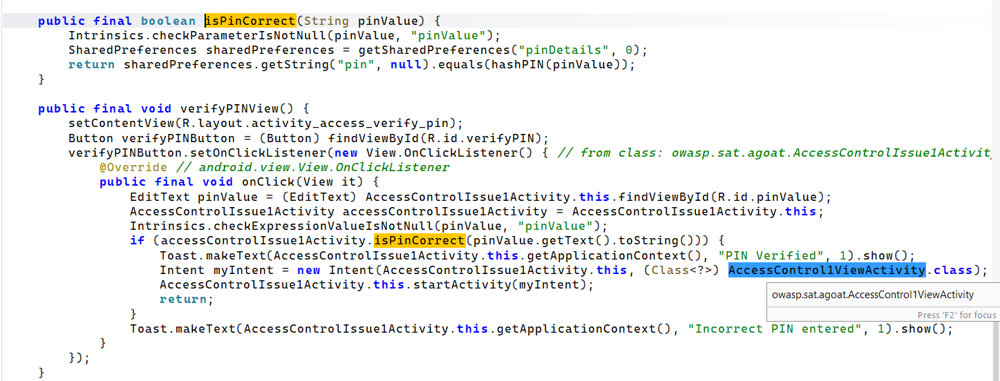
  **Step 4:** Decompiled source code shows the `isPinCorrect()` method and the intent to launch `AccessControl1ViewActivity.class`:
  
- **Mitigation:**
  - Set `android:exported="false"` for activities that should not be accessible from external apps.
  - Implement authorization checks within the `onCreate()` method of every sensitive activity.
- **References:**
  - [OWASP Mobile Top 10 — M1: Improper Platform Usage](https://owasp.org/www-project-mobile-top-10/2016-risks/m1-improper-platform-usage)
  - [CWE-926: Improper Export of Android Application Components](https://cwe.mitre.org/data/definitions/926.html)
---
 
## 8. Unprotected Android Components — Exported Service (Invoice Download Without Auth)
 
- **Severity:** Medium (CVSS 3.1: 5.3 — `CVSS:3.1/AV:L/AC:L/PR:N/UI:N/S:U/C:L/I:L/A:N`)
- **CWE:** [CWE-926: Improper Export of Android Application Components](https://cwe.mitre.org/data/definitions/926.html)
- **Description:** The `DownloadInvoiceService` is declared with `android:exported="true"` in the `AndroidManifest.xml`. This allows any application on the device to start this service without authentication.
- **Impact:** A malicious app can trigger the invoice download service directly, accessing sensitive business documents (invoices) without any PIN verification or user interaction.
- **Proof of Concept:**
  **Step 1:** Static analysis of `AndroidManifest.xml` shows the `DownloadInvoiceService` is exported (`android:exported="true"`):
  
  **Step 2:** Starting the service externally via ADB: `adb shell am startservice -n owasp.sat.agoat/.DownloadInvoiceService`:
  
  **Step 3:** The service is created successfully, displaying a "Service Created" toast:
  
  **Step 4:** The service triggers the invoice download, showing "Invoice is being downloaded":
  
  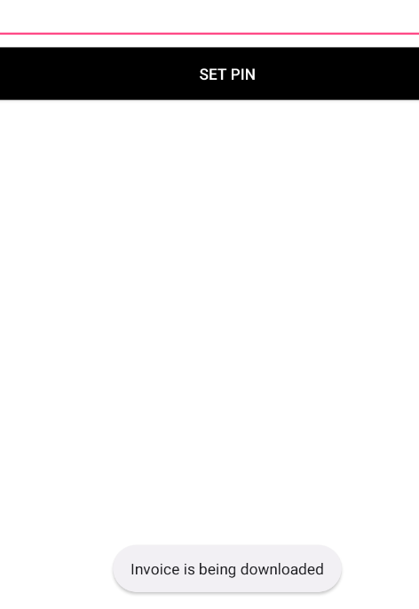
  
  **Step 5:** The download completes — `AndroGoatInvoice.txt` is saved to the Downloads folder:
  
  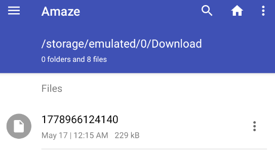
  
  **Step 6:** The downloaded file is visible in the file manager at `/storage/emulated/0/Download/`:
  
  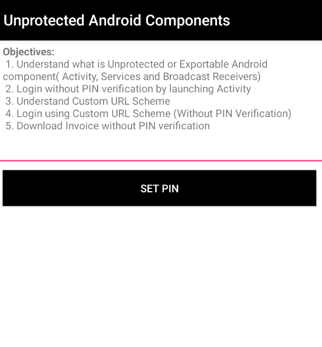
  
- **Mitigation:**
  - Set `android:exported="false"` for services that should not be accessible from other apps.
  - If the service must be exported, implement a custom permission with `android:protectionLevel="signature"` to restrict access to apps signed with the same key.
- **References:**
  - [OWASP Mobile Top 10 — M1: Improper Platform Usage](https://owasp.org/www-project-mobile-top-10/2016-risks/m1-improper-platform-usage)
  - [CWE-926: Improper Export of Android Application Components](https://cwe.mitre.org/data/definitions/926.html)
---
 
## 9. Unprotected Android Components — Deep Link Bypass (Custom URL Scheme)
 
- **Severity:** Medium (CVSS 3.1: 5.3 — `CVSS:3.1/AV:L/AC:L/PR:N/UI:N/S:U/C:L/I:L/A:N`)
- **CWE:** [CWE-939: Improper Authorization in Handler for Custom URL Scheme](https://cwe.mitre.org/data/definitions/939.html)
- **Description:** The `AccessControl1ViewActivity` is tied to a custom URL deep link scheme (`androgoat://vulnapp`) via an intent filter in `AndroidManifest.xml`. This allows direct invocation of the protected view activity without PIN verification.
- **Impact:** An attacker or a malicious app can invoke the protected activity directly using the deep link, bypassing the PIN authentication entirely to access the "Invoice" screen.
- **Proof of Concept:**
  **Step 1:** The "Unprotected Android Components" challenge lists objectives including "Login using Custom URL Scheme (Without PIN Verification)":
  
  
  
  **Step 2:** Static analysis of `AndroidManifest.xml` shows `<intent-filter>` for `AccessControl1ViewActivity` with `androgoat://vulnapp` scheme:
  
  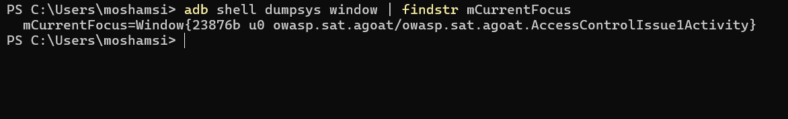
  
  **Step 3:** Executing the ADB command to trigger the deep link:
  
  `adb shell am start -W -a android.intent.action.VIEW -d "androgoat://vulnapp" owasp.sat.agoat`
  
  
  **Step 4:** The protected "Invoice" screen is rendered without authentication — the service is created and the invoice starts downloading:
  
  
  
  **Step 5:** "Invoice is being downloaded" toast message appears, confirming access bypass:
  
  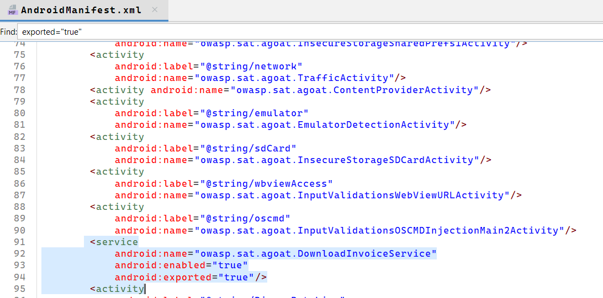
  
  **Step 6:** The invoice download completes successfully, accessible at `/storage/emulated/0/Download/AndroGoatInvoice.txt`:
  

  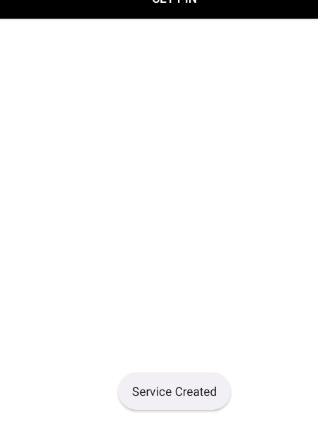
  
  **Step 7:** The protected view is displayed bypassing all PIN verification:
  
  
  
- **Mitigation:**
  - If the component does not need to be accessible from other apps, set `android:exported="false"`.
  - If deep linking is required, implement robust authorization and session validation checks within the `onCreate()` method of the target activity.
  - Use Android App Links (verified deep links) instead of custom URL schemes for better security.
- **References:**
  - [OWASP Mobile Top 10 — M1: Improper Platform Usage](https://owasp.org/www-project-mobile-top-10/2016-risks/m1-improper-platform-usage)
  - [CWE-939: Improper Authorization in Handler for Custom URL Scheme](https://cwe.mitre.org/data/definitions/939.html)
---
 
## 10. Unprotected Android Components — Exported Content Provider
 
- **Severity:** Low (CVSS 3.1: 3.3 — `CVSS:3.1/AV:L/AC:L/PR:N/UI:N/S:U/C:L/I:N/A:N`)
- **CWE:** [CWE-926: Improper Export of Android Application Components](https://cwe.mitre.org/data/definitions/926.html)
- **Description:** The `ContentProviderActivity` is declared in the `AndroidManifest.xml` and can be accessed by other applications on the device. Content Providers are designed to share data, but improperly secured ones can leak sensitive information.
- **Impact:** A malicious application on the same device could query the Content Provider to extract application data without user awareness.
- **Proof of Concept:**
  **Step 1:** The `AndroidManifest.xml` shows the `ContentProviderActivity` component:
  

  

  **Step 2:** The component can be launched from external applications using standard ADB intents:

  
  
- **Mitigation:**
  - Set `android:exported="false"` if the Content Provider does not need to share data with other apps.
  - Use `android:permission` attributes to define custom permissions for accessing the provider.
  - Implement fine-grained URI permissions.
- **References:**
  - [OWASP Mobile Top 10 — M1: Improper Platform Usage](https://owasp.org/www-project-mobile-top-10/2016-risks/m1-improper-platform-usage)
  - [CWE-926: Improper Export of Android Application Components](https://cwe.mitre.org/data/definitions/926.html)
---
 
## 11. Inadequate Root Detection
 
- **Severity:** Low (Defense-in-Depth) (CVSS 3.1: 3.3 — `CVSS:3.1/AV:L/AC:L/PR:N/UI:N/S:U/C:L/I:N/A:N`)
- **CWE:** [CWE-919: Weaknesses in Mobile Applications](https://cwe.mitre.org/data/definitions/919.html)
- **Description:** The application's root detection relies on simple checks for known root binaries and paths (e.g., `/system/app/Superuser.apk`, `/sbin/su`). These checks are easily identifiable and bypassable.
- **Impact:** Attackers can easily bypass these checks using runtime manipulation tools, enabling them to run the app on rooted devices for advanced dynamic analysis, memory dumping, and function hooking.
- **Proof of Concept:**

  **Step 1:** The Root Detection challenge shows the app correctly identifies the device as rooted ("Device is rooted"):

  

  **Step 2:** The root detection check is bypassed using the Objection runtime exploration framework with the command `android root disable`:

  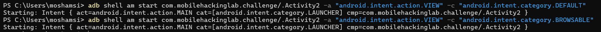

  **Step 3:** The app now incorrectly displays "Device is not rooted":

  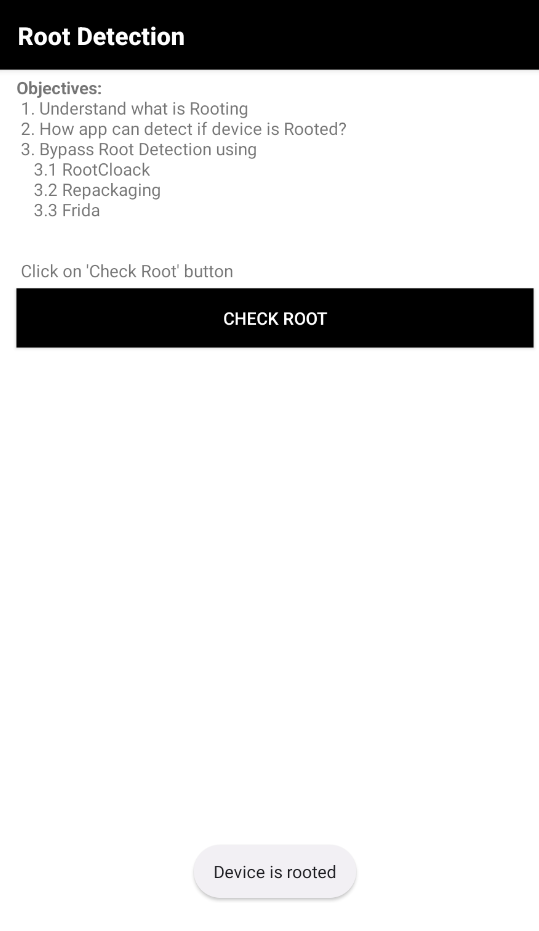
  
- **Mitigation:**
  - Implement the Google Play Integrity API for reliable environment attestation.
  - Combine multiple proprietary checks, execute them using native C/C++ libraries (JNI), and apply code obfuscation to make reverse engineering more difficult.
  - Use commercial solutions like RootBeer or SafetyNet (deprecated, use Play Integrity).
- **References:**
  - [OWASP Mobile Top 10 — M8: Code Tampering](https://owasp.org/www-project-mobile-top-10/2016-risks/m8-code-tampering)
  - [OWASP MSTG — Testing Root Detection](https://mas.owasp.org/MASTG/tests/android/MASVS-RESILIENCE/MASTG-TEST-0207/)
---
 
## 12. Inadequate Emulator Detection
 
- **Severity:** Low (Defense-in-Depth) (CVSS 3.1: 3.3 — `CVSS:3.1/AV:L/AC:L/PR:N/UI:N/S:U/C:L/I:N/A:N`)
- **CWE:** [CWE-919: Weaknesses in Mobile Applications](https://cwe.mitre.org/data/definitions/919.html)
- **Description:** Similar to root detection, the emulator detection logic is weak and relies on basic checks (build properties, telephony info) that can be trivially bypassed using runtime hooking frameworks.
- **Impact:** Enables attackers to run the app within a controlled emulator environment, significantly lowering the barrier to entry for dynamic analysis and exploitation.
- **Proof of Concept:**

  **Step 1:** The Emulator Detection challenge screen with its objectives:
  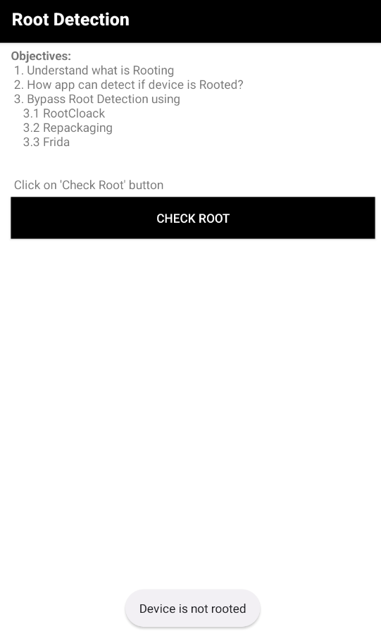
  
  **Step 2:** Bypassed using Frida with a public Codeshare script: `frida -U -f owasp.sat.agoat --codeshare cubetech126/root-and-emulator-detection-bypass`:
  
  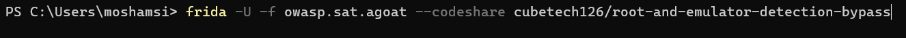
  
  **Step 3:** After the bypass, the emulator detection check returns "This is not Emulator":
  
  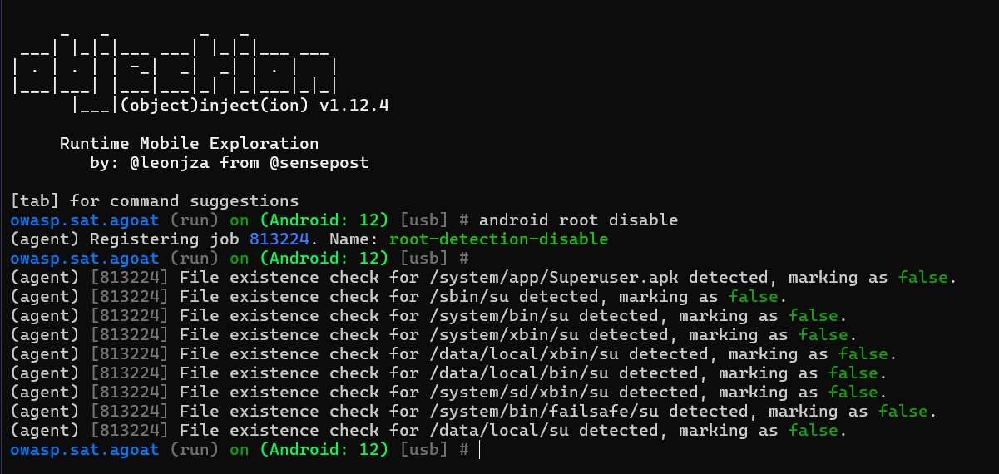
  
- **Mitigation:**
  - Inspect complex telephony and hardware properties that are difficult to emulate (e.g., sensor data, specific build props, battery state).
  - Like root detection, utilize the Play Integrity API.
  - Implement checks in native code (JNI) with obfuscation.
- **References:**
  - [OWASP Mobile Top 10 — M9: Reverse Engineering](https://owasp.org/www-project-mobile-top-10/2016-risks/m9-reverse-engineering)
  - [OWASP MSTG — Testing Emulator Detection](https://mas.owasp.org/MASTG/tests/android/MASVS-RESILIENCE/MASTG-TEST-0206/)
---
 
## General recommendations
 
1. Avoid storing sensitive data locally; when required, use encrypted storage backed by Android Keystore.
2. Do not trust the client for security decisions; enforce authorization and business rules server-side.
3. Minimize exported components; protect required ones with permissions and internal authorization checks.
4. Validate deep-link parameters and session state before granting access.
5. Use layered resilience controls (obfuscation, integrity checks, Play Integrity) while recognizing they are not primary protections.
## References
 
- [OWASP Mobile Top 10](https://owasp.org/www-project-mobile-top-10/)
- [OWASP MASVS / MASTG](https://mas.owasp.org/)
- [CWE-312](https://cwe.mitre.org/data/definitions/312.html) · [CWE-472](https://cwe.mitre.org/data/definitions/472.html) · [CWE-798](https://cwe.mitre.org/data/definitions/798.html) · [CWE-919](https://cwe.mitre.org/data/definitions/919.html) · [CWE-922](https://cwe.mitre.org/data/definitions/922.html) · [CWE-926](https://cwe.mitre.org/data/definitions/926.html) · [CWE-939](https://cwe.mitre.org/data/definitions/939.html)
- [Android Developer Security Best Practices](https://developer.android.com/topic/security/best-practices)
 
